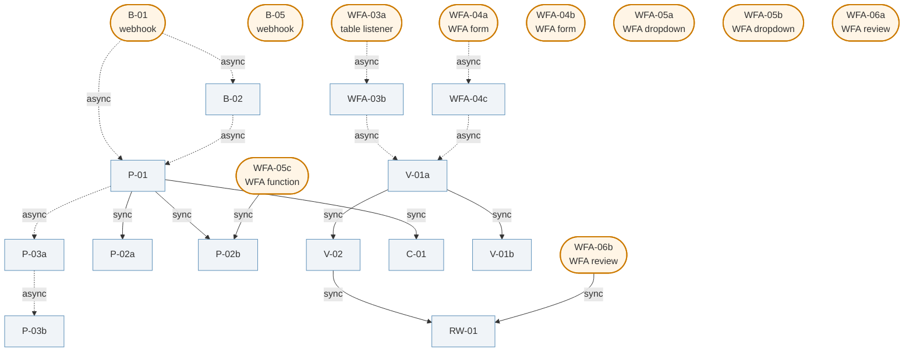
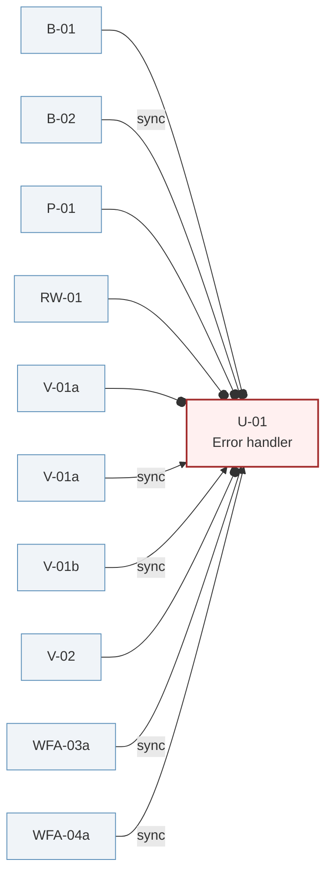

# SDC Recipe Call Graph

Mermaid diagrams of how recipes call each other across the system.
Solid edges are sync calls (the caller waits for the result); dashed
edges are async (fire-and-forget). Entry points are recipes triggered
by webhooks, table listeners, or WFA app functions — not called from
other recipes.

Generated from `recipe_catalog.json`.

---

## Primary call graph

U-01 (the error handler) is called from 9 recipes. To keep this view
readable, U-01's edges are omitted here and shown separately below.



**Reading the graph:**

- **Two intake paths converge on P-01.** B-01 fires a webhook, decides whether the request is new or a republish, and either dispatches through B-02 (new) or directly to P-01 (republish).
- **One validation entry point.** Both submission paths (file via WFA-03b, form via WFA-04c) converge on V-01a, which orchestrates V-01b (context prep) and V-02 (result routing). The fan-in on V-01a is structural — it's the canonical validation entry.
- **Two paths to RW-01.** Both V-02 (validation rejection) and WFA-06b (analyst rejection) call into the rework recipe synchronously. RW-01 is the unified handler for "this submission needs rework."
- **The WFA-05* recipes are dropdown/lookup helpers.** They're entry points but mostly read-only — they don't push the system forward, they just feed the analyst UI.

---

## U-01 fan-in (error handler)

Almost every recipe in the system calls U-01 — the error handler —
when something goes wrong. Most are async (log and continue). Three
are sync (V-01a, V-01b, B-02 — they wait for U-01's response).



**Note:** V-01a is shown twice because it calls U-01 both sync (during
validation orchestration) and async (after V-02 returns). The
duplicate node is a Mermaid limitation — Mermaid doesn't support two
edges of different types between the same pair of nodes cleanly. In
the actual recipe, it's one V-01a calling U-01 in two different
contexts.

---

## Sequence: the happy path of a single request

This view traces what happens when a webhook arrives, through
provisioning, supplier engagement, validation, and analyst review.
Async calls show as `--)>` (the caller doesn't wait); sync calls show
as `->>`.

```mermaid
sequenceDiagram
    participant Up as Upstream<br/>(webhook caller)
    participant B01 as B-01
    participant B02 as B-02
    participant P01 as P-01
    participant Sub as Sub-recipes<br/>(C-01, P-02a, P-02b, P-03a)
    participant Sup as Supplier flow<br/>(WFA-03b, WFA-04c)
    participant Val as Validation<br/>(V-01a, V-01b, V-02)
    participant Rev as Review<br/>(WFA-06a, WFA-06b)

    Up->>B01: webhook (correlation_id, config_file_id, ...)
    B01--)>B02: route request (new project)
    B02--)>P01: provision project
    P01->>Sub: C-01 (config validation, sync)
    P01->>Sub: P-02a (build templates, sync)
    P01->>Sub: P-02b (incumbent seed, sync)
    P01--)>Sub: P-03a (invitations, async)
    Note over P01: HOME_Requests → succeeded

    Note over Sup: (days/weeks later)
    Sup--)>Val: V-01a (validation, async)
    Val->>Val: V-01b → V-02 (sync chain)
    Note over Val: WFA_SupplierRequest →<br/>awaiting_review or rework_needed

    Note over Rev: (analyst reviews)
    Rev->>Rev: WFA-06a (approve)<br/>or WFA-06b → RW-01 (rework)
```

**What this view makes visible:**

- The system has **distinct phases that happen at very different times**. Provisioning completes in minutes; supplier engagement takes days or weeks; validation is fast once submission happens; review depends on analyst attention.
- The **sync chain inside validation** (V-01a → V-01b → V-02) is short and tight — the supplier sees their result in seconds. The **async dispatch into validation** (from supplier flow) is what makes the upstream non-blocking.
- **P-01 is the longest sync chain in the system.** It synchronously calls C-01, P-02a, and P-02b. Any of those failing makes P-01 fail. P-03a is dispatched async because invitations are a separate concern.

---

## Observations from the graph

A few patterns worth noticing:

**Most edges are async.** Of 21 recipe-to-recipe edges (excluding U-01), the majority are async. This reflects the system's nature — it's a long-running, multi-stage workflow, and most stage transitions don't need synchronous coordination. The sync edges are concentrated in: validation orchestration (V-01a → V-01b/V-02), provisioning sub-tasks that P-01 needs results from (C-01, P-02a, P-02b), and rework dispatch (V-02 → RW-01, WFA-06b → RW-01).

**No cycles.** The graph is a DAG (directed acyclic graph). No recipe calls a recipe that eventually calls back into itself. This is a good property — it means the call graph terminates and there are no possible infinite loops in recipe orchestration.

**P-01 is the deepest sync subgraph.** P-01 → C-01, P-01 → P-02a, P-01 → P-02b are all sync. Each of those sub-recipes has its own work but doesn't fan out further (C-01 is leaf-like, P-02a and P-02b have minimal outgoing edges). So P-01's failure modes are bounded by its three sync calls plus its own logic.

**V-01a has the longest sync chain.** V-01a → V-01b → (returns) → V-02 → (returns). Two sync calls in sequence. If either V-01b or V-02 fails, V-01a fails. This is the validation pipeline's critical path.

**WFA-05c is the only "WFA app function calls a callable recipe sync" edge.** Most WFA app functions are read-only or terminal (they don't call further recipes). WFA-05c is unusual because the late-arriving incumbent data flow needs to invoke the same P-02b that the original provisioning used. That edge is the catalog evidence for "P-02b serves both initial bootstrap and late-arriving updates" — clean reuse.

---

*Re-render this diagram whenever the recipe set changes. The mermaid
source is the source of truth; the markdown around it is commentary.*
