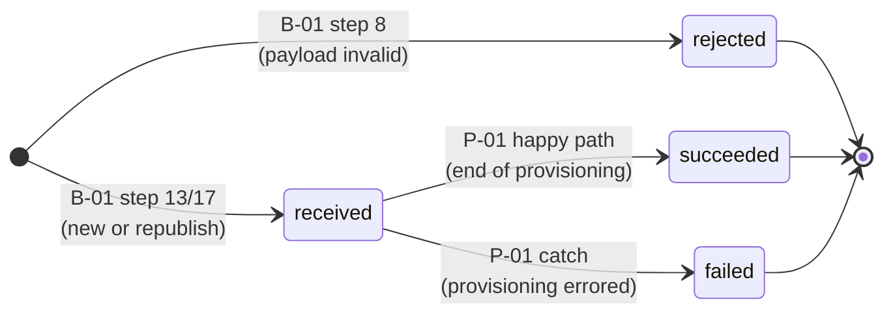
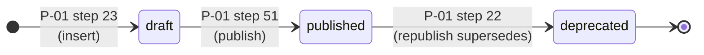
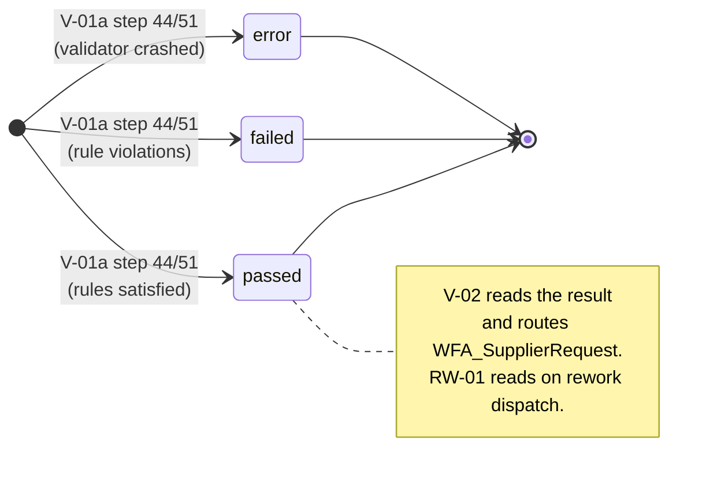
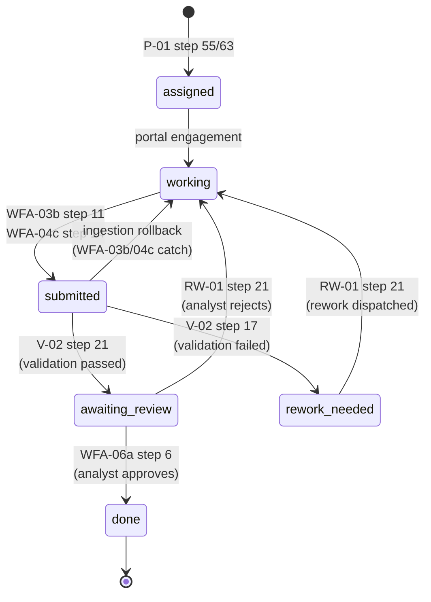
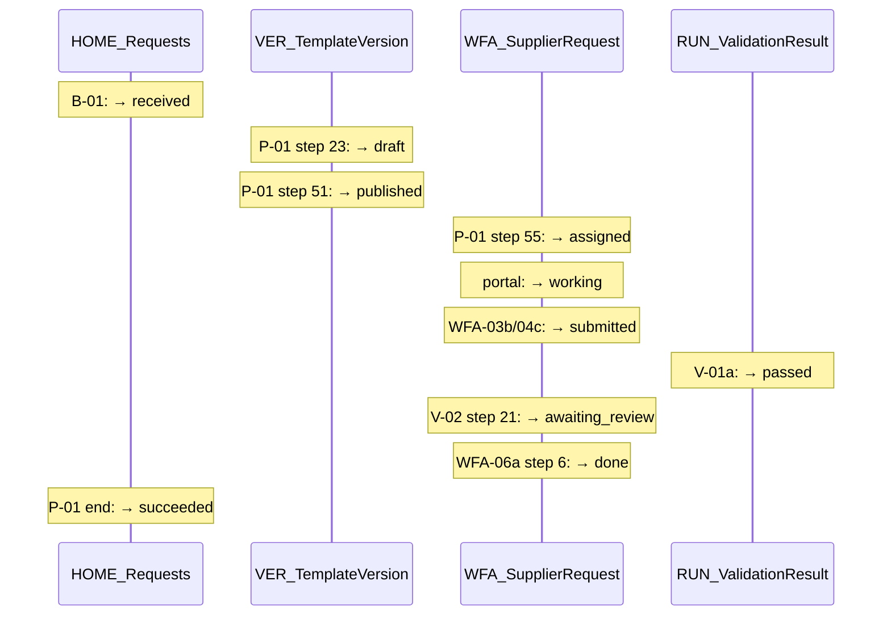

# SDC State Machines — Visual Reference

Four state machines, four diagrams, one cross-machine flow, one coverage matrix. All diagrams are mermaid — text-editable, render inline in any modern markdown viewer (GitHub, GitLab, VS Code with extensions, Obsidian, etc.).

Reflects the canonical model after the state-machine rationalization (see `state_implementation_guide.md` for the recipe edits that support these transitions).

---

## 1. HOME_Requests — request lifecycle

The outermost lifecycle. Every request enters through B-01 and ends in one of three terminal states. Most of the time, the request sits in `received` while downstream provisioning runs.

**Recipe ownership.** B-01 writes the entry state (received or rejected). P-01 owns both terminal transitions (succeeded at the end of its happy path, failed in its catch block). B-02 reads but does not transition under the rationalized model — its previous `status='active'` write at step 13 is dropped.

**Why three terminal states.** Rejected captures intake failure (payload was malformed; we never tried). Failed captures work failure (we tried, something broke). Succeeded captures completion. Each points to a different debugging path and a different operator response.

---

## 2. VER_TemplateVersion — template versioning

Single writer (P-01), three states, one repeating cycle: each republish drafts a new version, deprecates the previous published one, and publishes the new draft.

**Single writer.** All three transitions belong to P-01. Other recipes (P-02b, P-03a, WFA-05c) read versions but never transition them. The `template_file_ids` on the published row is the contract that downstream recipes consume.

**Multiple deprecated rows accumulate.** Each republish pushes the prior published version to deprecated and creates a new published one. Old deprecated rows remain as project history.

---

## 3. RUN_ValidationResult — validation outcomes

The smallest machine. V-01a inserts the row directly with the final status; there's no intermediate state in storage.

**Note on `running`.** The data model enum keeps `running` as a reserved state for future async pipelines. Today, V-01a inserts the row only at validation completion — there's no in-flight row to find.

**Prior results stay untouched.** When a supplier reworks, RW-01 does *not* update the prior RUN_ValidationResult row (the previous `superseded` write is being removed). Old results remain as historical fact; "current result" is answered by `ORDER BY created_at DESC LIMIT 1` against the upload's results.

---

## 4. WFA_SupplierRequest — supplier lifecycle

The busiest machine. Six states, eight recipes contending for the row across different transitions. Two distinct loops back to `working`: one is a rollback (when ingestion fails), one is rework (when validation or analyst rejects).

**Two loops back to working** — worth noting because they have different mechanisms even though the destination is the same:

- **Submission rollback** (dashed, conceptually): when WFA-03b or WFA-04c can't ingest the file/form data, the catch block reverts `submitted → working`. The supplier needs to retry the *submission*.
- **Rework dispatch** (RW-01): when V-02 fails validation or WFA-06a's analyst rejects, RW-01 transitions `rework_needed → working` or `awaiting_review → working`. The supplier needs to *redo work*.

**Recipe ownership** (compact form):

| Transition | Owner |
|---|---|
| `[*] → assigned` | P-01 (initial insert) |
| `assigned → working` | (portal-side, not a recipe) |
| `working → submitted` | WFA-03b, WFA-04c |
| `submitted → working` (rollback) | WFA-03b, WFA-04c (catch) |
| `submitted → awaiting_review` | V-02 |
| `submitted → rework_needed` | V-02 |
| `awaiting_review → done` | WFA-06a |
| `awaiting_review → working` | RW-01 |
| `rework_needed → working` | RW-01 |

---

## 5. Cross-machine flow — one request through the system

A single happy-path request, traced across all four state machines in sequence. Time flows left to right; each lifeline is one machine.
Notes show which recipe writes each transition.

**What this view makes visible:**

- **HOME_Requests has the longest lifeline.** It sits in `received` through the entire provisioning + submission + review sequence, and only transitions to `succeeded` when P-01 finishes. The request's lifecycle contains all the others.
- **VER_TemplateVersion's two transitions happen in a tight window.** Both occur inside P-01 — drafted at step 23, published at step 51. After that, the row is read by downstream recipes but never transitioned again.
- **WFA_SupplierRequest has the most movement** and is spread across the longest period. P-01 creates it as `assigned`; the supplier drives it through `working → submitted` over hours/days; V-02 routes the validation outcome; WFA-06a closes it.
- **RUN_ValidationResult is essentially instantaneous** — one row appears at validation completion, with the final status already set.

The four machines tick at very different rates. Flow-control diagrams that show all of them on one canvas can mislead the eye into thinking they advance in lockstep — they don't. HOME_Requests is the slowest; WFA_SupplierRequest is the most active; VER_TemplateVersion changes only during provisioning; RUN_ValidationResult only at validation moments.

---

## 6. Recipe ↔ state machine coverage matrix

Compact reference. R = read, W = write (insert), U = update.
Recipes that touch no state machine are omitted.

| Recipe | HOME_Requests | VER_TemplateVersion | WFA_SupplierRequest | RUN_ValidationResult |
|---|---|---|---|---|
| B-01 | R, W | · | · | · |
| B-02 | R, U | · | · | · |
| P-01 | R, U | R, W, U | R, W, U | · |
| P-02b | · | R | R, U | · |
| P-03a | · | R | R, U | · |
| V-01a | · | · | · | W |
| V-01b | · | · | R | · |
| V-02 | · | · | R, U | R |
| RW-01 | · | · | R, U | R |
| WFA-03b | · | · | R, U | · |
| WFA-04c | · | · | R, U | · |
| WFA-05b | · | · | R | · |
| WFA-05c | · | R | · | · |
| WFA-06a | · | · | R, U | · |
| WFA-06b | · | · | R | · |

**Recipes omitted** (no state-machine touches): B-05, P-02a, P-03b, C-01, U-01, WFA-03a, WFA-04a, WFA-04b, WFA-05a.

**Three patterns the matrix reveals:**

1. **P-01 is the only recipe with insert authority across multiple state machines** — it's the sole `R, W, U` cell on both VER_TemplateVersion and WFA_SupplierRequest. Combined with its `R, U` on HOME_Requests, P-01 has the broadest state-machine reach. This is what makes P-01 the most-decomposable recipe.
2. **HOME_Requests has the narrowest recipe coverage** (3 recipes) and **RUN_ValidationResult narrower still** (1 writer, 2 readers). Both are good candidates for clean invariants — fewer writers means fewer places drift can accumulate.
3. **WFA_SupplierRequest is read by 9 recipes and updated by 6.** This is the contention surface; vocabulary changes here ripple through more recipes than any other change.

---

## A note on rendering

Mermaid is supported natively by GitHub, GitLab, Obsidian, VS Code (with the Markdown Preview Mermaid Support extension), and most modern markdown viewers. If you're viewing this somewhere that doesn't render mermaid, the source is still readable — the diagram syntax is mostly the structure described in prose around it.

If you ever want SVG or PNG exports, the mermaid CLI ()`mmdc`) can convert any of these blocks. The diagrams will re-render correctly after recipe changes as long as the transition labels stay accurate — that's the upside of text-based diagrams over hand-drawn ones.

---

*Generated 2026-04-29 from the recipe catalog and the state implementation guide. Re-validate after recipes change.*