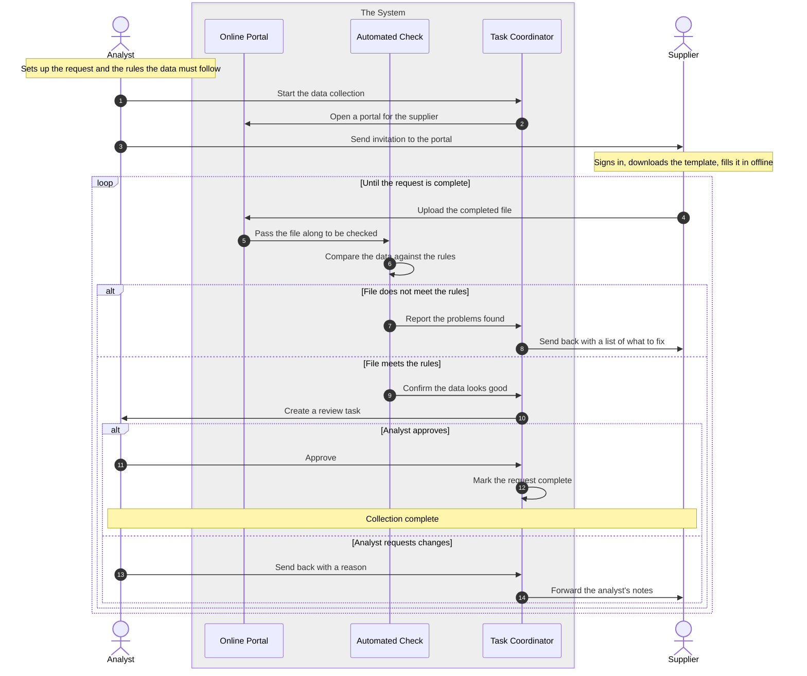

Here's the clean Mermaid source on its own:



One honest clarification, since you noticed a gap: the "wonderful detail" you saw — the purple participants, teal notes, dark-mode adaptation, rounded corners — does **not** live in the Mermaid source. That syntax is plain and renderer-agnostic. The polish came entirely from the *rendering configuration* wrapped around it: a `mermaid.initialize({ themeVariables: {...} })` block that maps colors to the design system. The diagram source just says "this is a note, this is an actor"; the theme decides what those look like.

So pasting the code above into a standard renderer (GitHub, Confluence, mermaid.live) gives you the correct structure with that tool's *default* styling, not the colors you saw here.

If you want the colors to travel with the diagram, you have two options. The lightweight one is a front-matter init block, which mermaid.live and recent GitHub support:

```mermaid
%%{init: {'theme':'base','themeVariables':{
  'actorBkg':'#EEEDFE','actorBorder':'#534AB7','actorTextColor':'#26215C',
  'noteBkgColor':'#E1F5EE','noteBorderColor':'#0F6E56','noteTextColor':'#04342C',
  'signalColor':'#5F5E5A','labelBoxBkgColor':'#F1EFE8','labelBoxBorderColor':'#888780'
}}}%%
sequenceDiagram
    autonumber
    actor A as Analyst
    ...
```

That gets you the light-mode colors anywhere that honors `%%{init}%%`. The catch: it's static, so it won't auto-flip for dark mode — the JS version did that by detecting the user's color scheme at render time, which front-matter can't do.

Want me to emit the full source with that init block prepended so it's a single self-contained copy-paste?
