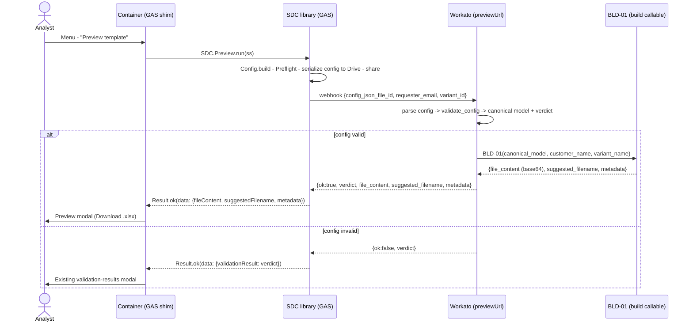

# SDC Template Preview — Implementation Sketch

An analyst-facing **"Preview template"** action: build the supplier XLSX from the
*current* workbook config, hand it back as an ephemeral download in a modal, and
reuse the existing validation-error modal when the config can't be built. No
version minted, no workspace provisioned, no supplier touched.

The guiding idea: a preview is just **validate + build**, two things that already
exist. The build (`py_eval`, internally `TPL-02`) is already a pure function of the
canonical model, and your `Validate` flow already produces that canonical model.
So most of the work is composition, not new logic.

## Data flow



The base64 rides the synchronous webhook response, GAS reconstructs the bytes in
the browser, and the analyst downloads — opening it in **Excel**, which is the
only place the `INDIRECT`/named-range dependent dropdowns behave the way a
supplier will see them.

---

## Piece 1 — Container: menu item (EDIT `onOpen`)

Add one line, right after the Validate item — preview is the same *kind* of
analyst dry-run:

```javascript
  var SM_implementation = ui.createMenu('Supplier data collection')
    .addItem('Start supplier data collection', 'initializeWorkspace')
    .addItem('Update configuration',           'updateWorkspace')
    .addItem('Validate configuration',         'validateConfiguration')
    .addItem('Preview template',               'previewTemplate')   // <-- new
    .addItem('Request portal access',          'requestPortalAccess')
    .addItem('Send supplier invitations',      'sendAllInvitations')
    .addItem('Set up field IDs',               'setupPrimaryKeyColumns');
```

## Piece 2 — Container: handler + modal renderer (NEW functions)

`previewTemplate()` mirrors `validateConfiguration()` exactly, plus one branch for
the file. Note the deliberate reuse of `showValidationResults_` for the invalid
path — the analyst sees the *same* error modal they'd get from Validate, because
the verdict comes from the same `validate_config`.

```javascript
/**
 * Template preview flow. Builds the supplier XLSX from the CURRENT workbook
 * config and offers it as an ephemeral download. On an invalid config, reuses
 * the standard validation-results modal (same verdict shape as Validate).
 */
function previewTemplate() {
  var ss = SpreadsheetApp.getActiveSpreadsheet();
  ss.toast('Building template preview...', 'Status');
  var r = SDC.Preview.run(ss);
  ss.toast('');

  if (r.ok && r.data && r.data.fileContent) {
    showTemplatePreview_(r.data);
  } else if (r.ok && r.data && r.data.validationResult) {
    showValidationResults_(r.data.validationResult);   // existing modal, reused
  } else {
    showResult_(r);                                     // hard failure / fallback
  }
}

/**
 * Render the built template in a modal with an ephemeral download. The bytes
 * never leave the browser; nothing is written to Drive. Template lives in the
 * container so workbooks can rebrand without library changes (same pattern as
 * validate_results / invitation_results).
 */
function showTemplatePreview_(data) {
  var t = HtmlService.createTemplateFromFile('preview_template');
  t.b64      = data.fileContent;
  t.filename = data.suggestedFilename || 'preview.xlsx';
  t.meta     = data.metadata || {};

  var html = t.evaluate().setWidth(440).setHeight(320);
  SpreadsheetApp.getUi().showModalDialog(html, 'Template preview');
}
```

And two tiny edits to existing helpers so the failure-fallback path is labelled
correctly:

```javascript
// In flowTitle_(flow): add a case
    case 'preview':         return 'Template preview';

// In showsCorrelationId_(flow): include preview (the webhook is a real Workato
// request worth surfacing if it errors)
function showsCorrelationId_(flow) {
  return flow === 'provision' || flow === 'validate' ||
         flow === 'portalInvite' || flow === 'invitations' ||
         flow === 'preview';
}
```

## Piece 3 — Container HTML: `preview_template.html` (NEW file)

Functional, gesture-driven download via `Blob` + object URL — *not* a `data:`
URI (those are blocked from Apps Script's sandboxed iframe). Filename goes in a
`data-` attribute so an odd character can't break the injected JS string; the
base64 alphabet is safe to inject directly into a single-quoted string.

```html
<!DOCTYPE html>
<html>
  <head>
    <base target="_top">
    <style>
      body { font: 13px/1.5 Arial, sans-serif; margin: 16px; color: #222; }
      .meta { color: #555; margin: 8px 0 16px; }
      .meta b { color: #222; }
      button { font-size: 13px; padding: 8px 14px; cursor: pointer; }
      .primary { background: #1a73e8; color: #fff; border: 1px solid #1a73e8; border-radius: 4px; }
      .note { margin-top: 16px; padding: 10px; background: #fef7e0; border-radius: 4px; color: #5f4b00; }
    </style>
  </head>
  <body>
    <? var sheets = (meta.sheet_names || []).join(', ');
       var kb = meta.byte_size ? (meta.byte_size / 1024).toFixed(1) + ' KB' : '?'; ?>

    <div>Built from the current workbook config.</div>
    <div class="meta">
      <b><?= meta.field_count || '?' ?></b> fields,
      <b><?= meta.row_count || '?' ?></b> data rows,
      <b><?= kb ?></b><br>
      Sheets: <?= sheets ?>
    </div>

    <button id="dl" class="primary" data-name="<?= filename ?>">Download .xlsx</button>
    <button onclick="google.script.host.close()">Close</button>

    <div class="note">
      Open the downloaded file in <b>Excel</b> to verify the dependent dropdowns.
      Opening it in Google Sheets re-imports the file and won't reproduce the
      <code>INDIRECT</code> / named-range behavior a supplier sees.
    </div>

    <script>
      var B64 = '<?= b64 ?>';
      var MIME = 'application/vnd.openxmlformats-officedocument.spreadsheetml.sheet';

      function toBlob(b64, mime) {
        var bin = atob(b64);
        var arr = new Uint8Array(bin.length);
        for (var i = 0; i < bin.length; i++) arr[i] = bin.charCodeAt(i);
        return new Blob([arr], { type: mime });
      }

      document.getElementById('dl').addEventListener('click', function () {
        var name = this.getAttribute('data-name') || 'preview.xlsx';
        var url = URL.createObjectURL(toBlob(B64, MIME));
        var a = document.createElement('a');
        a.href = url; a.download = name;
        document.body.appendChild(a); a.click(); a.remove();
        setTimeout(function () { URL.revokeObjectURL(url); }, 1000);
      });
    </script>
  </body>
</html>
```

> If your built files ever grow past a few hundred KB, swap the inline `B64`
> injection for a lazy fetch: stash the base64 in `CacheService` keyed by a
> token in `Preview.run`, pass only the token into the template, and pull it
> with `google.script.run.withSuccessHandler(...)` on first click. For
> tens-of-KB previews, inline is simpler and fine.

---

## Piece 4 — Library: `SDC.Preview` namespace (NEW, e.g. `010_Preview.js`)

Near-clone of `Validate.run`. Same serialize-to-Drive + share path on the way in
(this is what keeps the preview's canonical model **byte-identical** to what
provisioning builds). The only real differences: the `previewUrl` webhook, and
splitting the response into the file path vs the validation-error path.

```javascript
var Preview = {};

/**
 * Build a preview of the supplier XLSX from the current workbook config.
 *
 * Reuses the validate ingest (serialize -> share -> validate_config) so the
 * canonical model is identical to what provisioning would build, then asks
 * Workato to run the build callable and return the file as base64.
 *
 * @param {Spreadsheet} ss
 * @param {Object}      [opts]
 * @param {string}      [opts.variantId]  Optional; preview a specific variant.
 *                                         Empty/absent = base template.
 * @returns {Object} canonical Result. On success carries data.fileContent
 *          (base64). On an invalid config, carries data.validationResult
 *          (same shape Validate returns) so the container can reuse the
 *          validation-results modal.
 */
Preview.run = function(ss, opts) {
  if (!ss) throw new Error('Preview.run: ss is required.');
  opts = opts || {};

  var correlationId = Util.newCorrelationId();
  var log = Log.forCorrelation(ss, correlationId);

  log('INFO', 'Starting template preview...');

  try {
    var config = Stage.run('config', function() {
      return Config.build(ss);
    });

    var pf = Stage.run('preflight', function() {
      return Preflight.run(ss, config, {
        webhookUrl:          config.webhook.previewUrl,
        webhookLabel:        'previewUrl',
        requireCustomerData: false
      });
    });

    Stage.run('primary-key-backfill', function() {
      return PrimaryKey.backfill(ss);
    });

    // Reuse the 'validate' purpose: the inbound config file is transient and
    // identical to what validate ships. (Add a 'preview' purpose later only if
    // you want distinct cleanup prefixes.)
    var baseResult = Stage.run('serialize', function() {
      return Drive.serializeConfig(ss, config, { purpose: 'validate' });
    });
    var configJsonFileId = baseResult.fileId;
    log('INFO', 'Preview config serialized. File ID: ' + configJsonFileId);

    Stage.run('share-with-workato', function() {
      Drive.shareWithIntegrationAccount(configJsonFileId, pf.integrationAccountEmail);
    });

    var payload = Payload.preview({
      correlationId:    correlationId,
      configJsonFileId: configJsonFileId,
      requesterEmail:   Util.getActiveUserEmail(),
      variantId:        opts.variantId || ''
    });

    var response = Stage.run('webhook', function() {
      return Webhook.call(config.webhook.previewUrl, payload);
    });

    var parsed = response.parsed;
    if (!parsed) {
      var err = new Error('Preview webhook returned a non-JSON body: ' +
                          String(response.body || '').substring(0, 200));
      err.stage = 'webhook-response';
      throw err;
    }

    // Invalid config: hand back the verdict in Validate's shape so the
    // container reuses the existing validation-results modal.
    var verdict = parsed.verdict || {};
    if (parsed.ok === false || verdict.status !== 'success' || !parsed.file_content) {
      log('INFO', 'Preview: config not buildable; returning validation results.');
      return Result.ok({
        flow:          'preview',
        correlationId: correlationId,
        message:       'Configuration is not yet valid to build.',
        data:          { validationResult: verdict }
      });
    }

    log('SUCCESS', 'Preview built (' + (parsed.suggested_filename || 'preview.xlsx') + ').');

    return Result.ok({
      flow:          'preview',
      correlationId: correlationId,
      message:       'Template preview built.',
      data: {
        fileContent:       parsed.file_content,        // base64
        suggestedFilename: parsed.suggested_filename,
        metadata:          parsed.metadata || {},
        verdict:           verdict
      }
    });
  } catch (e) {
    var stage = e.stage || 'unknown';
    log('ERROR', 'Preview failed at ' + stage + ': ' + e.message);
    return Result.fail({
      flow:          'preview',
      correlationId: correlationId,
      message:       'Preview failed at ' + stage + ':\n\n' + e.message,
      error:         e
    });
  }
};
```

## Piece 5 — Library: payload + config wiring (EDITS)

`Payload.preview` mirrors `Payload.validate`, with an optional variant:

```javascript
Payload.preview = function(args) {
  Payload._requireArgs(args, ['correlationId', 'configJsonFileId', 'requesterEmail'],
                       'preview');
  return {
    correlation_id:      args.correlationId,
    config_json_file_id: args.configJsonFileId,
    requester_email:     args.requesterEmail,
    variant_id:          args.variantId || '',
    timestamp:           new Date().toISOString()
  };
};
```

And one line in the `Config.build` webhook block:

```javascript
    webhook: {
      url:             get('webhook', 'fileExportUrl'),
      validateUrl:     get('webhook', 'validateUrl'),
      invitationsUrl:  get('webhook', 'invitationsUrl'),
      portalInviteUrl: get('webhook', 'portalInviteUrl'),
      previewUrl:      get('webhook', 'previewUrl')      // <-- new; add to _developer_settings
    }
```

---

## Workato side (build in the editor, two changes)

**1. Extract the build into a callable — `BLD-01 Build XLSX`.**
Today the build is the `py_eval` embedded inside TPL-01 (its own docstring already
calls it `TPL-02`). Lift that `py_eval` verbatim into a callable recipe:

- **Input:** `canonical_model_json`, `variant_id`, `customer_name`, `variant_name`
- **Output:** `verdict`, `file_content`, `suggested_filename`, `metadata`
- **Body:** the existing `py_eval`, unchanged.

Then change TPL-01's build step from "run py_eval" to "call BLD-01" with the
canonical model it already reads. TPL-01's external behavior is unchanged. Now
there's exactly one copy of the 19 KB builder. *(If `C-02` already is this
callable, point Preview at `C-02` and skip this step.)*

**2. New recipe — `Preview` (webhook trigger at `previewUrl`).**
This is literally your validate front-end plus one call:

1. Receive `{ config_json_file_id, requester_email, variant_id }`.
2. **Reuse the exact validate ingest** — read the config from Drive, parse, and
   run `validate_config` to get the canonical model + verdict. (If `C-01` already
   isolates parse/validate→canonical-model, Preview is just `C-01` → `BLD-01`.)
   Reusing the same ingest is what guarantees the preview equals the live build.
3. If the verdict isn't `success`: respond `{ ok: false, verdict }`.
4. Else: pull `customer_name` from the parsed config, resolve `variant_name`,
   call `BLD-01`, and respond
   `{ ok: true, verdict, file_content, suggested_filename, metadata }`.

> **Fidelity rule:** the verdict object returned on the invalid path must match
> the shape `Validate` returns (so `showValidationResults_` / `validate_results.html`
> render it). Since both go through the same `validate_config`, they will — just
> don't reshape it in the Preview recipe.

---

## Two integrity watch-points

1. **Canonical-model fidelity.** `Drive.serializeConfig` keys on `purpose`. As long
   as `purpose` only affects file lifecycle (transient vs audit-shared) and never
   changes serialized *content*, the preview is honest. If it ever forks the
   canonical model, the preview quietly lies about what provisioning will build.
2. **Excel, not Sheets.** The dependent-dropdown machinery is Excel-flavored. The
   modal nudges toward downloading and opening in Excel; the in-modal download
   path structurally enforces this (you can't "open in Sheets" something that was
   never written to Drive). This is the subtle thing that makes "confirm it's
   functional" actually mean something.

## Optional: persist to Drive instead (the "maybe they'll seed" hedge)

If you later want the preview to double as a seed-data scratchpad, swap the modal
for a Drive write in `previewTemplate()` — the file is then a real workbook in the
analyst's Drive, and a future ingest has the exact column/validation structure
waiting. Use `createFile(blob)` (NOT the Advanced Drive Service, which would
*convert* it to a Google Sheet and discard the XLSX):

```javascript
var bytes  = Utilities.base64Decode(data.fileContent);
var blob   = Utilities.newBlob(bytes,
  'application/vnd.openxmlformats-officedocument.spreadsheetml.sheet',
  data.suggestedFilename || 'preview.xlsx');
var folder = Drive.resolveDestinationFolder(ss, config);  // existing
Drive.cleanupOldFiles(folder, ['preview_']);              // existing sweep, new prefix
var file   = folder.createFile(blob);                     // stays XLSX
// surface file.getDownloadUrl() so QA still happens in Excel, not Sheets
```

The two paths aren't mutually exclusive — you can offer both a Download button
(ephemeral) and a "Save to Drive" button (persisted) in the same modal. Start
with download-only; add Save-to-Drive the day the seeding use actually shows up.

## Suggested test order

1. **Happy path** on a known-good config → modal shows, download opens in Excel,
   dependent dropdowns cascade correctly.
2. **Invalid config** (e.g. a lookup with no parent) → existing validation modal
   appears, no file. Confirms the shared-verdict reuse.
3. **Fidelity** → preview a config, then actually provision it, and diff the two
   generated XLSX files. They should be identical.
4. **Managed-browser download** → run it on a real analyst's locked-down Chrome
   profile, not just yours. The sandboxed-iframe download is the one piece most
   exposed to enterprise browser policy.
